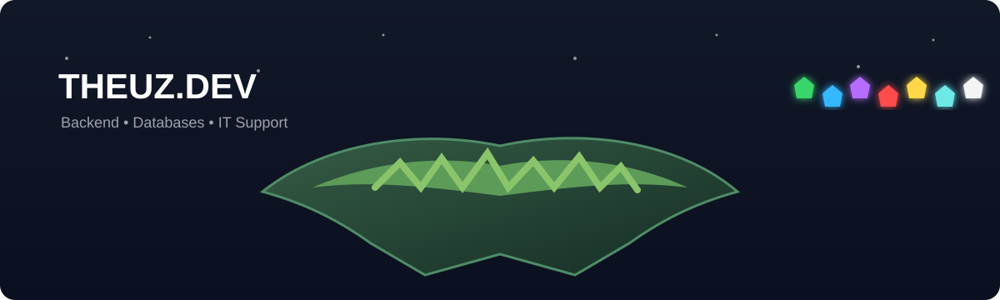
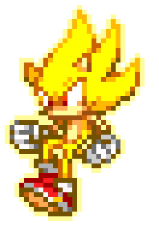
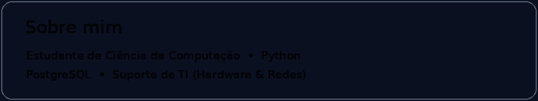

 

---

## 🌀 Tecnologias & Estudos

| Linguagem | Banco de Dados | Suporte |
|:---:|:---:|:---:|
| 🐍 **Python** | 🐘 **PostgreSQL** | 🖥️ **Hardware** |
| 📚 Em estudo | 🗄️ Em estudo | 🌐 **Redes** |

---

## 💻 Linguagens que estudo

---

## 💎 Chaos Emeralds

🟢　🔵　🟣　🔴　🟡　🩵　⚪

Power • Knowledge • Curiosity • Evolution

---

### 🦔 “Gotta go fast — but code clean.”

